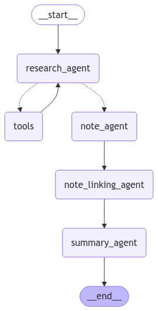

# ExoMind

ExoMind is a research assistant that utilises an agentic swarm and a knowledge graph to facilitate research about exoplanets.
The swarm is made up of multiple agents working together to anwsers users research questions.
The results of the research are stored in an Obsidian Vault - a knowledge graph linking existing notes.
The information available to the swarm is stored in a vector database, a SQL database and a web-search tool.

This way an end-user has access to a verified database of information about exoplanets, and a constantly updating knowledge graph allowing the user to monitor the links between researched topics and access past research results at any time.

## Check out the website:

## Check out the video of the demo:

<video src="demo.mp4" width="420" height="340" controls>
  Your browser does not support the video tag.
</video>

## Agentic Architecture

The swarm is made up of 4 main agents:

1. **Research Agent** - Searches available data sources for most relevant and up-to date information.
2. **Note Creation Agent** - Based on the search results creates a note summarising research findings.
4. **Note Linking Agent** - Links the notes in Obsidian Vault and the newly created note.
3. **Summary Agent** - Summarises the research findings in a concise and readibly manner for the user.

**The swarm is build using LangGraph:**

## Features
- Access to a web-search tool
- Access to a vector database with research papers about exoplanets
- Access to a SQL database with numeric information from NASA's Expoplanet Archive
- Access to a Obsidian Vault as a knowledge graph

## Notes

Since the application uses a web-hosted vector database, a SQL database and a vast volume of research papers, the application cannot be hosted locally. If you would like to run the application, use the link to the website above.

# The Team:

Feel free to contact us with any questions or feedback!

- [@Zvapo](https://github.com/Zvapo)
- [@wojtasmat](https://github.com/wojtasmat)
- [@JacobKaczmarek](https://github.com/JacobKaczmarek)
- [@syrianah](https://github.com/syrianah)

# License

This project is licensed under the MIT License. See the [LICENSE](LICENSE) file for details.

